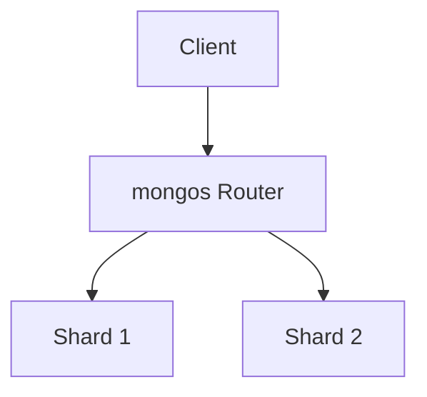

# Component Reference

Every component is auto-imported from `components/`. Props listed here are the
authoritative signatures — re-check `components/<Name>.vue` if in doubt.

Components are HTML, not markdown: **indent children with two spaces and do not
leave blank lines inside a component**, or Slidev will parse the body as markdown.

---

## Lists

### `<BulletedList>`

| Prop | Type | Default |
| --- | --- | --- |
| `title` | String | `''` — rendered as the section heading |

Children are plain `<li>` elements; nest sub-points in a `<ul>`.

```markdown
<BulletedList title="Eigenschaften">
  <li>Schemafrei
    <ul>
      <li>Dokumente einer Collection dürfen abweichen</li>
    </ul>
  </li>
  <li>Horizontal skalierbar</li>
</BulletedList>
```

### `<NumberedList>`

| Prop | Type | Default |
| --- | --- | --- |
| `title` | String | `''` |
| `size` | `'sm' \| 'md'` | `'sm'` — badge size |
| `start` | Number | `1` — first badge number, for lists continued on the next slide |

Only direct `<li>` children are picked up. The canonical item shape is a `<span>`
headline plus an optional `<SubText>`:

```markdown
<NumberedList title="Entwicklungsmeilensteine">
  <li>
    <span><HighlightedText>2007 – Gründung</HighlightedText> – 10gen entwickelt MongoDB</span>
    <SubText>Ursprünglich Teil einer Platform-as-a-Service-Lösung</SubText>
  </li>
  <li>
    <span><HighlightedText>2009 – Open Source</HighlightedText> – Veröffentlichung als eigenständige DB</span>
  </li>
</NumberedList>
```

Continuing across a slide break: end at item 3, then `<NumberedList :start="4">`.

---

## Typography

### `<Text>`

| Prop | Type | Default |
| --- | --- | --- |
| `title` | String | `''` |

A titled prose block — the default container for a paragraph of explanation.

### `<HighlightedText>`

| Prop | Type | Default |
| --- | --- | --- |
| `color` | String | `var(--fh-orange, #f79646)` |
| `weight` | String | `'500'` |

Inline emphasis in the brand orange. Use for 2–3 key terms per slide at most; both
props exist for exceptions and are rarely worth setting.

### `<SubText>`

No props. Gray, smaller explanatory line. Always sits on its own line *after* the
content it explains — inside a `<Text>`, or as the second line of a list item.

```markdown
<Text title="Kernmerkmale">
  Speichert Daten als <HighlightedText>BSON-Dokumente</HighlightedText> in Collections.
  <SubText>Schema-Änderungen ohne komplexe Migrationen</SubText>
</Text>
```

### `<SectionTitle>`

| Prop | Type | Default |
| --- | --- | --- |
| `text` | String | `''` |

The heading used internally by `Text`, `BulletedList`, `NumberedList`, `Table` and
`CitationTable`. Prefer those components' `title` prop; only use `SectionTitle`
directly to head something that has no `title` of its own.

---

## Boxes — at most one per slide

### `<DefinitionBox>`

| Prop | Type | Required |
| --- | --- | --- |
| `title` | String | yes — the term being defined |
| `source` | String | no |

Formal definition of a term. `source` renders as an attribution line.

### `<ExampleBox>`

| Prop | Type | Required |
| --- | --- | --- |
| `title` | String | yes |
| `source` | String | no |

Concrete example or best practice.

### `<Quotebox>`

| Prop | Type | Required |
| --- | --- | --- |
| `source` | String | no — e.g. `"Chodorow, MongoDB 2015"` |

Verbatim quotation; put the quotation marks in the body text.

```markdown
<DefinitionBox title="Sharding" source="MongoDB Manual 2024">
  Horizontale Partitionierung von Daten über mehrere Server hinweg.
</DefinitionBox>
```

> There is no `HighlightBox` component in this repo despite older docs mentioning
> one. Use `<ExampleBox>` or `<DefinitionBox>`.

---

## Layout

### `<Columns>`

| Prop | Type | Default |
| --- | --- | --- |
| `columns` | String | `'1fr 1fr'` — any CSS grid-template-columns value |
| `gap` | String | `'2rem'` |

Blank-line-separated blocks become the columns. Best for comparisons, code vs.
explanation, before/after.

```markdown
<Columns columns="1fr 1fr">

<Text title="Embedding">
  Verschachtelte Dokumente in einem Datensatz.
</Text>

<Text title="Referencing">
  Verweise über <HighlightedText>ObjectIds</HighlightedText>.
</Text>

</Columns>
```

### `<Divider>`

| Prop | Type | Default |
| --- | --- | --- |
| `length` | String \| Number | `100` (percent) |
| `color` | String | `'border-fh-orange'` (UnoCSS class) |
| `thickness` | String | `'border-t'` |

Horizontal rule between two blocks on a dense slide. Usually unnecessary — reach
for a slide split instead.

---

## `<Table>`

| Prop | Type | Required | Default |
| --- | --- | --- | --- |
| `headers` | Array | yes | — strings, or `{ text, width }` objects |
| `rows` | Array | yes | array of string arrays |
| `title` | String | no | `''` |
| `caption` | String | no | `''` |
| `columnWidths` | Array | no | `[]` — takes precedence over `header.width` |

Cells accept inline HTML: `<code>`, `<strong>`, `<em>`, `<br>`.

```markdown
<Table
  :headers="['Operation', 'Methode', 'Beispiel']"
  :columnWidths="['25%', '30%', '45%']"
  :rows="[
    ['Create', '<code>insertOne()</code>', 'Fügt ein Dokument ein'],
    ['Read', '<code>find()</code>', 'Liest mehrere Dokumente']
  ]"
  caption="CRUD-Operationen im Überblick"
/>
```

Keep tables to ~5 rows; beyond that, split across slides.

---

## `<Todo>`

| Prop | Type | Default |
| --- | --- | --- |
| `text` | String | `''` |

Inline placeholder badge for unfinished content. Use while drafting; never leave
one in a deck presented as finished.

```markdown
<Todo text="Benchmark-Zahlen ergänzen" />
```

---

## Internal components

`SlideLayout`, `Outline`, `OutlineItem`, `ChapterOutline`, `NumberBadge`,
`CoverBackdrop` are used *by the layouts*. Do not place them in slide bodies.

---

## Code blocks

Native fenced blocks with a language tag — there is no `<Code>` component.

````markdown
```javascript
db.users.find({ age: { $gte: 18 } })
```
````

Slidev's line-highlight syntax reveals a block step by step; `|` separates the
click steps:

````markdown
```javascript {1-3|4-9|10-15}
```
````

Keep a code slide to roughly 20 lines and give it no other components besides an
optional short `<Text>`.

## Diagrams

Mermaid and PlantUML render natively. Keep them vertical and compact — slides are
wider than they are tall, but a wide graph shrinks the labels past legibility.

````markdown

````
