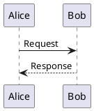

# Slidev Presentation Style Guide

Follow these conventions when creating or editing Slidev presentation files.

## File Structure

Every Slidev presentation must follow this exact structure:

1. **Frontmatter** - Metadata configuration
2. **Cover Slide** - `layout: cover`
3. **Chapter Intros** - `layout: chapter-intro` before each new chapter
4. **Content Slides** - Standard slides with `title` and `subtitle`
5. **Closing Slide** - `layout: closing`

## Required Frontmatter

Always include complete frontmatter at the top of the file:
````yaml
---
theme: default
highlighter: shiki
fonts:
  sans: 'Nunito Sans'
  serif: 'Nunito Sans'
  mono: 'Fira Code'
  weights: '400,600,700'
presentationInfo:
  title: 'Presentation Title'
  subtitle: 'Subtitle'
  semester: 'Wintersemester 2025/26'
  authors:
    - name: 'Author Name'
      matrikelnummer: 1234567
      email: 'email@fh-muenster.de'
  chapters:
    - number: 1
      title: 'Chapter Title'
---
````

## Slide Layout Patterns

### Cover Slide (First Slide)
````markdown
---
layout: cover
---
````

### Chapter Introduction (Before Each Chapter)
````markdown
---
layout: chapter-intro
chapter: 1
---
````

### Content Slides (Standard)
````markdown
---
title: Slide Title
subtitle: Slide Subtitle
chapter: 1
---

<Content here>
````

**Important:** Always include `chapter` with numeric value on content slides to show chapter name in footer.

### Closing Slide (Last Slide)
````markdown
---
layout: closing
---
````

## Component Usage

### ALWAYS Use Custom Components

**Never use raw markdown lists** - Always wrap in components:

#### Lists
- `<BulletedList title="Title">` - For unordered lists
- `<NumberedList title="Title">` - For ordered lists
- Nest `<ul>` inside list items for sub-points
````markdown
<BulletedList title="Main Points">
  <li>First point
    <ul>
      <li>Sub-point A</li>
      <li>Sub-point B</li>
    </ul>
  </li>
  <li>Second point</li>
</BulletedList>
````

#### Text Formatting
- `<Text title="Title">` - For paragraphs with title
- `<HighlightedText>` - For emphasized terms
- `<SubText>` - For explanatory subtexts
````markdown
<Text title="Section Title">
  Main content with <HighlightedText>important terms</HighlightedText>.
  <SubText>Additional context or explanation</SubText>
</Text>
````

#### Columns
Use `<Columns>` for side-by-side comparisons or when content fits well on both sides:
````markdown
<Columns>

Left column content

Right column content

</Columns>
````

**Best used for:** Comparisons, code vs explanation, before/after scenarios

#### Boxes
- `<DefinitionBox title="Term" source="Source">` - For formal definitions (left border only, italic text)
- `<ExampleBox title="Title">` - For practical examples and tips (full border, normal text)
- `<HighlightBox title="Title">` - For important notes and warnings
- `<Quotebox source="Source">` - For quotes and citations

#### Tables
````markdown
<Table 
  :headers="['Header 1', 'Header 2', 'Header 3']"
  :columnWidths="['33%', '33%', '34%']"
  :rows="[
    ['Cell 1', 'Cell 2', 'Cell 3'],
    ['Cell 4', 'Cell 5', 'Cell 6']
  ]"
  caption="Optional caption text"
/>
````

Use HTML formatting in cells: `<code>`, `<strong>`, `<em>`, `<br>`

#### Footnotes
Add inline footnote references that automatically number and collect at slide bottom:
````markdown
Text content<Footnote text="Reference or explanation" />
Another point<Footnote text="Vgl. [Source23, S. 42]" />
````

Footnotes are automatically:
- Numbered sequentially per slide
- Displayed at the bottom with orange background stripe
- Reset for each new slide

#### Citations
````markdown
<CitationTable 
  tTypography

### Text Components

#### Text Component
Use for paragraph content with optional title:
````markdown
<Text title="Section Title">
  Main content text with normal formatting.
  <SubText>Additional context or explanatory notes</SubText>
</Text>
````

#### HighlightedText
Emphasize key terms and concepts in orange (FH brand color):
````markdown
MongoDB uses <HighlightedText>BSON documents</HighlightedText> for storage.
````
- Default color: `--fh-orange` (#f79646)
- Default weight: 500 (medium)
- Use sparingly for important terms only

#### SubText
Add secondary information below main points:
````markdown
<SubText>This is explanatory text in gray, smaller font</SubText>
````
- Always appears on new line (block display)
- Gray color for visual hierarchy
- Use for context, examples, or clarifications

### Typography Best Practices

1. **Hierarchy**: Use title → main text → SubText for clear structure
2. **Highlighting**: Only highlight 2-3 key terms per slide
3. **SubText placement**: Always after the related main content
4. **Consistency**: Use same patterns across similar content types

## Formatting Rules

1. **No raw markdown bullets** - Always use `<BulletedList>` or `<NumberedList>`
2. **Always use code blocks** - Use native markdown with language specification
/>
````

## Formatting Rules

1. **No raw markdown Use native markdown code blocks with language specification (NO `<Code>` component)
3. **Language specification** - Always specify language for syntax highlighting
4. **One blank line** - Between slides (single `---` separator)
5. **No inline styles** - Use components and CSS variables
6. **CSS variables** - Use `--fh-blue`, `--fh-orange` for colors
7. **Font sizes** - Never set inline, use global CSS
8. **Chapter numbers** - Always include numeric `chapter` value in frontmatter for footer display

## Diagrams and Visualizations

### Mermaid Support
Slidev supports Mermaid diagrams out of the box. Use for flowcharts, sequences, and relationships:

````markdown
```mermaid
chapter: 1
---

<DefinitionBox title="Term Name" source="Source Reference 2024">
  Clear, formal definition of the term or concept.
</DefinitionBox>

<Text title="Additional Context">
  Explanatory text with <HighlightedText>key terms</HighlightedText>.
  <SubText>Supporting details or examples</SubText>
</Text>
````

### Example/Best Practice Slide
````markdown
---
title: Practical Application
subtitle: Real-World Example
chapter: 1
---

```javascript
// Practical code example
db.collection.find({ status: "active" })
```

<ExampleBox title="Why This Approach?">
  Explanation of the practical benefits and use cases with <HighlightedText>key points</HighlightedText>.
</ExampleBoxze appropriately** - Must fit on slide alongside other content
- **Use sparingly** - Only when visual flow adds value

### PlantUML Support
PlantUML is also supported for UML diagrams, sequence diagrams, and more:

````markdown

````

**PlantUML Best Practices:**
- **Vertical layout** - Default orientation works well
- **Keep simple** - Avoid overly complex diagrams
- **Size conscious** - Ensure legibility on slides` for colors
7. **Font sizes** - Never set inline, use global CSS

## Common Slide Patterns
`markdown
---
title: Comparison Topic
subtitle: Contrasting Approaches
chapter: 1
---

<Columns>

<BulletedList title="Approach A">
  <li>Point 1
    <ul>
      <li>Detail A</li
  Clear definition of the term or concept.
</DefinitionBox>

<Text title="Additional Context">
  Explanatory text with <HighlightedText>key terms</HighlightedText>.
  <SubText>Supporting details or examples</SubText>
chapter: 1
---

```javascript
function example() {
  return true;
}
```

<Text title="Explanation">
  Describe what the code does with <HighlightedText>key concepts</HighlightedText>.
  <SubText>Additional context or best practices</SubText>
</Text>
````

**Code Block Features:**
- Use line highlighting: ` ```javascript {1-3|5} ` for step-by-step reveals
- Always specify language for proper syntax highlighting
- NO `<Code>` component wrapper - use native markdown code blocksi>Point 2</li>
</BulletedList>

<BulletedList title="Approach B">
  <li>Point 1
    <ul>
      <li>Detail A</li>
      <li>Detail B</li>
    </ul>
  </li>
  <li>Point 2</li>
</BulletedList>

</Columns>
````

### Code Example Slide
````markdown
chapter: 1
---

<NumberedList title="Main Steps">
  <li>
    <span><HighlightedText>Step Name</HighlightedText> - Brief description</span>
    <SubText>Additional context or explanation</SubText>
  </li>
  <li>
    <span><HighlightedText>Step Name</HighlightedText> - Brief description</span>
    <SubText>Additional context or explanation</SubText>
  </li>
</NumberedList>
````

chapter: 1
**Nested Bullets:**
````markdown
<BulletedList title="Main Points">
  <li>Top level point
    <ul>
      <li>Nested point A</li>
      <li>Nested point B
        <ul>
          <li>Deep nested point</li>
        </ul>
      </li>
    </ul>
  </li>
</BulletedList>
````

### Quote Slide
````markdown
---
title: Expert Opinion
subtitle: Industry Perspective
chapter: 1
---

<Quotebox source="Author Name, Publication 2024">
  "Quote text goes here. Can be multiple sentences."
</Quotebox>

<BulletedList title="Key Takeaways">
  <li>Point from the quote</li>
  <li>Another insight</li>
</BulletedList>
````

## Anti-Patterns (NEVER DO)

❌ Raw markdown lists without components
````markdown
- Point 1
- Point 2
````

❌ Inline styles
````markdown
<div style="color: blue">Text</div>
````

❌ Missing titles on content slides
````markdown
---
---
Content without title
````

❌ Skipping chapter intros
````markdown
---
layout: cover
---

---
title: First Content Slide
---
````

❌ Inconsistent component usage
````markdown
<BulletedList title="Title">
  <li>Item 1</li>
</BulletedList>

- Raw markdown item
````

## Citation Slides (End of Presentation)

Always include proper citations before the closing slide:
````markdown
---
title: Quellen
subtitle: Literatur und Dokumentation
---

<CitationTable 
  title="Quellen"
  :citations="[
    { id: '[ABC24]', text: 'Author, A.: <em>Book Title</em>, Publisher, 2024' },
    { id: '[XYZ23]', text: 'Smith, J.: <em>Article Title</em>, Journal, 2023' }
  ]"
/>

---
title: Weitere Ressourcen
subtitle: Online-Materialien
---

<CitationTable 
  title="Nützliche Links"
  :citations="[
    { id: 'Website', text: 'Description: <em>https://example.com</em>' }
  ]"
/>

---
layout: closing
---
````

## Content Organization Best Practices

### Information Hierarchy

1. **Slide Title & Subtitle** - Always present, describe slide content clearly
2. **Primary Content** - Main component (List, Table, DefinitionBox, etc.)
3. **Supporting Content** - Text components with additional context
4. **References** - Footnotes at bottom (automatically positioned)

### Component Selection Guide & Priority

**Priority Order (use in this sequence):**
1. **Basic Content Components** (SectionTitle, BulletedList, NumberedList, Text)
2. **Typography Elements** (HighlightedText, SubText)
3. **Special Boxes** (DefinitionBox, ExampleBox, HighlightBox, Quotebox)
4. **Layout Components** (Columns, Table)
5. **Visualizations** (Mermaid, PlantUML)

**For Definitions:**
- Primary: `<DefinitionBox>` with source (formal definitions)
- Supporting: `<Text>` or `<HighlightBox>` for additional context

**For Examples & Best Practices:**
- Primary: `<ExampleBox>` with title (practical tips)
- Supporting: Code blocks or `<BulletedList>` for details

**For Lists & Steps:**
- Primary: `<NumberedList>` (sequential) or `<BulletedList>` (unordered)
- Supporting: Use `<SubText>` within list items for details
- Highlight: Use `<HighlightedText>` for key terms in list items
- **Nesting:** Use `<ul>` inside `<li>` for nested bullets (up to 3 levels)

**For Comparisons:**
- Layout: `<Columns>` with two `<BulletedList>` components
- Alternative: Single `<Table>` for structured comparison
- **Use when:** Side-by-side content makes sense or space is well-utilized

**For Data & Statistics:**
- Primary: `<Table>` for structured data
- **Use when:** Information is tabular or needs clear comparison structure
- Supporting: `<Text>` for interpretation

**For Quotes & References:**
- Primary: `<Quotebox>` with source attribution
- Supporting: `<BulletedList>` for key takeaways

**For Code Examples:**
- Native markdown code blocks with language specification (NO wrapper component)
- Line highlighting: ` ```lang {1-3|5} ` for step-by-step reveals
- Supporting: `<Text>` or `<BulletedList>` for explanation
- Consider: `<ExampleBox>` for practical tips related to code

**FComponent Organization Best Practices

### Arranging Components on a Slide

**Typical Order:**
1. **Primary Content** - Main component (DefinitionBox, NumberedList, code block, etc.)
2. **Supporting Content** - ExampleBox, Text, or BulletedList for additional context
3. **Footnotes** - Automatically positioned at bottom

**Example Well-Organized Slide:**
````markdown
---
title: Index Operations
subtitle: Creating and Managing Indexes
chapter: 4
---

```javascript
db.users.createIndex({ email: 1 }, { unique: true })
```

<ExampleBox title="Best Practice: Background Creation">
  Use <HighlightedText>background: true</HighlightedText> option in production to avoid blocking operations during index creation.
</ExampleBox>

<Text title="Key Considerations">
  Index creation impacts write performance<Footnote text="Vgl. [MongoDB Docs, Performance]" />.
  <SubText>Balance between read optimization and write overhead</SubText>
</Text>
````

### Avoid Over-Crowding

- **Max 2-3 major components** per slide
- **Max 1 box component** (DefinitionBox, ExampleBox, etc.) per slide
- **Use SubText** instead of additional paragraphs
- **Split complex content** across multiple slides

## Summary

When creating slides:
1. Start with proper frontmatter including chapters array
2. Add cover slide
3. Use chapter-intro before each chapter
4. Always include `chapter` number on content slides
5. Always use custom components (never raw markdown)
6. Prioritize basic elements first, then typography, then special components
7. Use Tables when information is structured
8. Use Columns for comparisons or side-by-side content
9. Use Mermaid/PlantUML for diagrams (keep vertical and compact)
10. Follow content organization best practices
11. Maintain clear information hierarchy
12. End with citations and closing slide. **Primary Content** - Main component (List, Table, DefinitionBox, etc.)
3. **Supporting Content** - Text components with additional context
4. **References** - Footnotes at bottom (automatically positioned)

### Component Selection Guide

**For Definitions:**
- Primary: `<DefinitionBox>` with source
- Supporting: `<Text>` or `<HighlightBox>` for additional context

**For Lists & Steps:**
- Primary: `<NumberedList>` (sequential) or `<BulletedList>` (unordered)
- Supporting: Use `<SubText>` within list items for details
- Highlight: Use `<HighlightedText>` for key terms in list items

**For Comparisons:**
- Layout: `<Columns>` with two `<BulletedList>` components
- Alternative: Single `<Table>` for structured comparison

**For Data & Statistics:**
- Primary: `<Table>` for structured data
- Supporting: `<Text>` for interpretation

**For Quotes & References:**
- Primary: `<Quotebox>` with source attribution
- Supporting: `<BulletedList>` for key takeaways

**For Code Examples:**
- Code block with language specification
- Supporting: `<Text>` or `<BulletedList>` for explanation
- Use `{line-numbers}` syntax for highlighting specific lines

### Slide Density Guidelines

- **Maximum 2-3 major components** per slide
- **Maximum 5-7 bullet points** in a list
- **Maximum 3-4 columns** in a table
- **Use SubText** to add detail without cluttering
- **Split complex content** across multiple slides

### Visual Balance

1. **White space**: Don't overcrowd slides
2. **Columns**: Use for side-by-side comparisons
3. **Boxes**: Use sparingly for emphasis (1 per slide max)
4. **Consistency**: Use same patterns for similar content types

## Summary

When creating slides:
1. Start with proper frontmatter
2. Add cover slide
3. Use chapter-intro before each chapter
4. Always use custom components (never raw markdown)
5. Include title and subtitle on content slides
6. Follow content organization best practices
7. Maintain clear information hierarchy
8. End with citations and closing slide
9