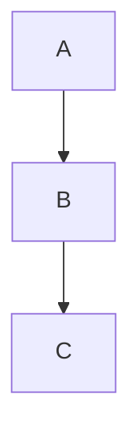

# Slidev Presentation Skill

See `example.md` in this skill folder for a complete, working reference presentation.

## File Structure

Every presentation follows this exact order:

1. Frontmatter
2. Cover slide (`layout: cover`)
3. For each chapter: chapter-intro slide + content slides
4. Citations slide(s)
5. Closing slide (`layout: closing`)

## Frontmatter

```yaml
---
theme: default
highlighter: shiki
fonts:
  sans: 'Nunito Sans'
  serif: 'Nunito Sans'
  mono: 'Fira Code'
  weights: '400,600,700'
presentationInfo:
  title: 'Presentation Title'
  subtitle: 'Subtitle'
  semester: 'Wintersemester 2025/26'
  authors:
    - name: 'Author Name'
      matrikelnummer: 1234567
      email: 'email@fh-muenster.de'
  chapters:
    - number: 1
      title: 'Chapter Title'
---
```

## Slide Layouts

```markdown
---
layout: cover
---

---
layout: chapter-intro
chapter: 1
---

---
title: Chapter Title
subtitle: Slide-Specific Heading
chapter: 1
---

---
layout: closing
---
```

**Convention:** `title` = the chapter title (identical for every slide in that chapter). `subtitle` = the specific heading of this individual slide.

Always include `chapter: <number>` on content slides — it drives the footer.

## Components

**Never use raw markdown lists or inline styles.** Always use the custom components below.

### Lists

```markdown
<BulletedList title="Title">
  <li>First point
    <ul>
      <li>Sub-point</li>
    </ul>
  </li>
  <li>Second point</li>
</BulletedList>

<NumberedList title="Steps">
  <li>
    <span><HighlightedText>Step Name</HighlightedText> - Description</span>
    <SubText>Additional context</SubText>
  </li>
</NumberedList>
```

### Text & Typography

```markdown
<Text title="Section Title">
  Content with <HighlightedText>key term</HighlightedText>.
  <SubText>Explanatory note in gray</SubText>
</Text>
```

- `<HighlightedText>` — orange brand color, use sparingly (2–3 terms per slide max)
- `<SubText>` — gray, smaller, always on its own line after related content

### Boxes (max 1 per slide)

```markdown
<DefinitionBox title="Term" source="Source 2024">
  Formal definition text.
</DefinitionBox>

<ExampleBox title="Best Practice">
  Practical tip with <HighlightedText>key point</HighlightedText>.
</ExampleBox>

<HighlightBox title="Important">
  Warning or note.
</HighlightBox>

<Quotebox source="Author, Publication 2024">
  "Quote text."
</Quotebox>
```

### Columns

```markdown
<Columns>

Left content

Right content

</Columns>
```

Best for: comparisons, code vs. explanation, before/after.

### Table

```markdown
<Table 
  :headers="['Header 1', 'Header 2', 'Header 3']"
  :columnWidths="['33%', '33%', '34%']"
  :rows="[
    ['Cell 1', 'Cell 2', 'Cell 3'],
    ['<code>snippet</code>', '<strong>bold</strong>', 'normal']
  ]"
  caption="Optional caption"
/>
```

Use HTML tags inside cells: `<code>`, `<strong>`, `<em>`, `<br>`.

### Footnotes

```markdown
Some claim<Footnote text="Vgl. [Src23, S. 42]" /> with auto-numbered reference.
```

Footnotes are numbered per slide and rendered at the bottom automatically.

### Citations (end of presentation)

```markdown
---
title: Quellen
subtitle: Literatur und Dokumentation
---

<CitationTable 
  :citations="[
    { id: '[ABC24]', text: 'Author, A.: <em>Book Title</em>, Publisher, 2024' },
    { id: '[XYZ23]', text: 'Smith, J.: <em>Article Title</em>, Journal, 2023' }
  ]"
/>
```

### Images

Use `<Image>` for all figures. Figures with `caption` or `source` are automatically numbered via the `useFigures` composable and ordered by DOM position.

```markdown
<Image
  src="/images/diagram.png"
  alt="Architecture overview"
  caption="Systemarchitektur"
  source="Mustermann 2024"
  maxWidth="80%"
  height="300px"
  captionAlign="center"
/>
```

Props:
- `src` *(required)* — image path (relative to `public/`)
- `alt` — accessible alt text
- `caption` — figure description shown below image; triggers auto-numbering
- `source` — source reference shown in italic after caption
- `maxWidth` — CSS max-width of the figure wrapper (default `100%`)
- `height` — CSS max-height of the image (default `auto`)
- `captionAlign` — `left` | `center` | `right` (default `left`)
- `figureId` — optional explicit ID to override the auto-generated one

### Figure List (Abbildungsverzeichnis)

Place `<FigureList>` on a dedicated slide **after** all content slides and **before** the closing slide. It auto-collects every `<Image>` that has a `caption` or `source` and renders them in DOM order.

```markdown
---
title: Abbildungsverzeichnis
subtitle: Verwendete Abbildungen
---

<FigureList />
```

Renders a table with columns: Nr. · Beschreibung · Quelle. No manual maintenance needed.

## Code Blocks

Use native markdown fenced blocks with language — never a `<Code>` component wrapper.

```markdown
```javascript
db.users.find({ age: { $gte: 18 } })
```
```

Line-highlight syntax for step-by-step reveals:

```markdown
```javascript {1-3|4-9|10-15}
```
```

## Diagrams

Mermaid and PlantUML are supported natively. Keep diagrams vertical and compact.

```markdown

```

## Slide Density Rules

- Max **2–3 major components** per slide
- Max **1 box** (DefinitionBox / ExampleBox / etc.) per slide
- Max **5–7 bullet points** in a list
- Use `<SubText>` instead of adding extra paragraphs
- Split complex content across multiple slides

## Anti-Patterns

```markdown
❌ Raw markdown lists         → use <BulletedList>
❌ Inline styles              → use components and CSS variables
❌ Missing title on slide     → always include title + subtitle
❌ Skipping chapter-intro     → required before every chapter
❌ <Code> wrapper component   → use native fenced code blocks
❌ Raw  tags             → use <Image> for auto-numbering
❌ Manual figure list         → use <FigureList> (auto-generated)
```