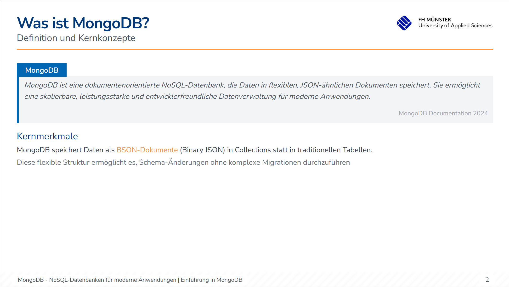
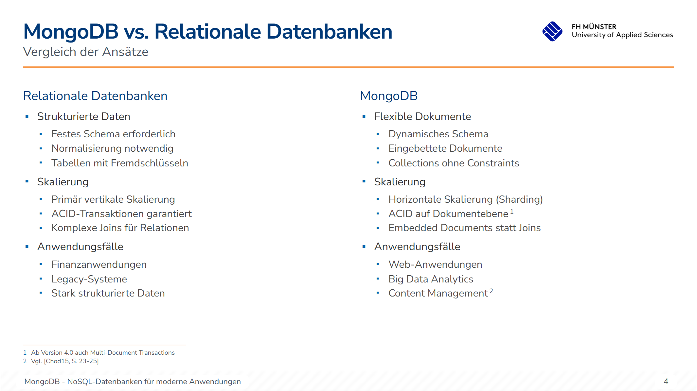
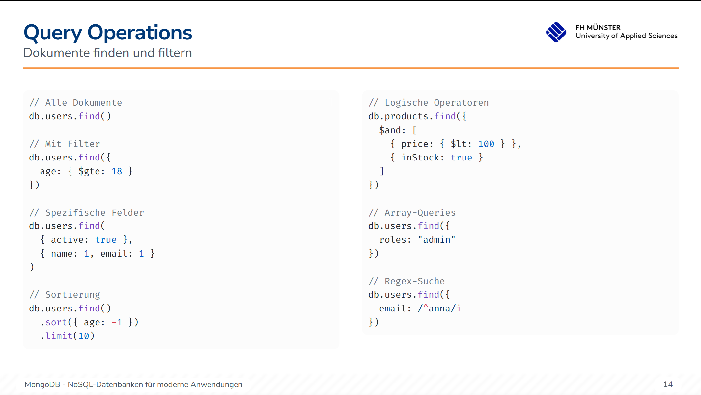
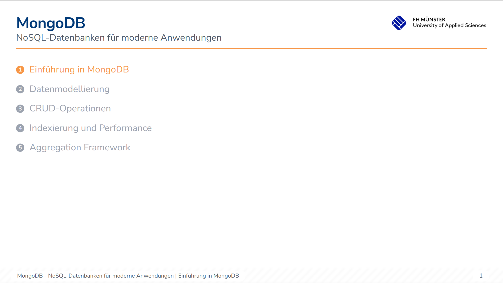
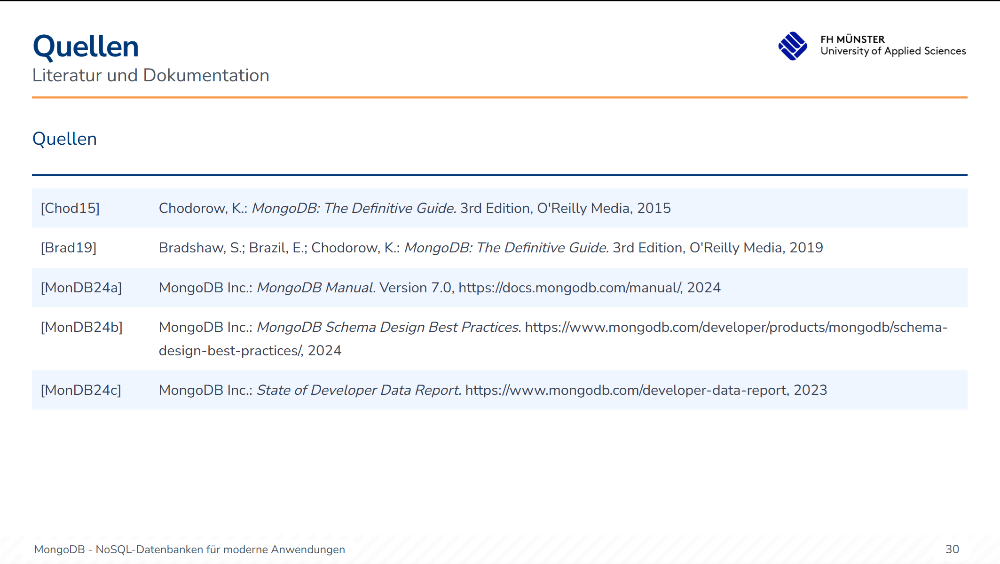

# FH Münster Slidev Starter

A professional slide deck starter for [FH Münster](https://www.fh-muenster.de/) presentations, built with [Slidev](https://sli.dev/). Features custom components in FH corporate design and opinionated style guides for consistent, high-quality academic presentations.

## Features

- 🎨 **FH Corporate Design** - Pre-built components matching FH Münster branding
- 📦 **Ready-to-use Components** - Rich component library for academic content
- 📏 **Opinionated Style Guide** - Best practices for consistent presentations
- 🚀 **Slidev Powered** - Fast, modern, developer-friendly presentation framework
- 📝 **Markdown-based** - Write slides in Markdown with component syntax

## Quick Start

```bash
npm install

npm run dev

# Visit http://localhost:3030
```

Edit [slides.md](./slides.md) to create your presentation.

## Demo

<table>
  <tr>
    <td></td>
    <td></td>
  </tr>
  <tr>
    <td></td>
    <td></td>
  </tr>
  <tr>
    <td></td>
    <td></td>
  </tr>
</table>

## Supported Components

### Layout Components
- **`<SlideLayout>`** - Main slide wrapper with header, footer, and footnotes
- **`<Columns>`** - Two-column layout for comparisons
- **`<Table>`** - Styled tables with custom headers and column widths

### Content Components
- **`<BulletedList>`** - Unordered lists with FH styling (supports nesting up to 3 levels)
- **`<NumberedList>`** - Ordered lists with numbered badges
- **`<Text>`** - Paragraph content with optional section title
- **`<CitationTable>`** - Bibliography and reference lists

### Typography Components
- **`<HighlightedText>`** - Emphasized text in FH orange
- **`<SubText>`** - Secondary explanatory text in gray
- **`<SectionTitle>`** - Consistent section headings

### Box Components
- **`<DefinitionBox>`** - Formal definitions with source attribution (left border, italic text)
- **`<ExampleBox>`** - Practical examples and tips (full border, normal text)
- **`<HighlightBox>`** - Important notes and warnings
- **`<Quotebox>`** - Quotes and citations with source

### Special Components
- **`<Footnote>`** - Inline footnote references (auto-numbered, collected at bottom)
- **`<ChapterOutline>`** - Visual chapter navigation
- **`<OutlineItem>`** - Individual outline entries

### Utility Components
- **`<Divider>`** - Horizontal separators with customizable length and color
- **`<Image>`** - Responsive images with captions
- **`<NumberBadge>`** - Styled number badges for lists

## Layouts

- **`cover`** - Title slide with FH branding
- **`chapter-intro`** - Chapter introduction with large number
- **`default`** - Standard content slide with title and subtitle
- **`closing`** - Final slide with thank you message

## Style Guide

The project includes comprehensive style guides in `.github/instructions/`:
- Component usage patterns
- Content organization best practices
- Typography guidelines
- Code formatting rules
- Mermaid & PlantUML diagram support

All slides must include proper frontmatter with chapter information for automatic footer generation.

## Project Structure

```
slidev/
├── slides.md              # Main presentation file
├── components/            # Custom Vue components
├── layouts/               # Slide layouts
├── composables/           # Vue composables
├── public/                # Static assets
│   └── images/           # Presentation images
└── setup/                 # Slidev configuration
```

## Resources

- [Slidev Documentation](https://sli.dev/)
- [FH Münster Corporate Design](https://www.fh-muenster.de/)
- [Style Guide](.github/instructions/style-guide.instructions.md)

## License

Created for FH Münster academic presentations.

