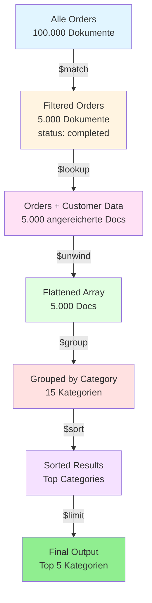

layout: cover

---
layout: chapter-intro
chapter: 1
---

---
title: Was ist MongoDB?
subtitle: Definition und Kernkonzepte
chapter: 1
---

<DefinitionBox title="MongoDB" source="MongoDB Documentation 2024">
  MongoDB ist eine dokumentenorientierte NoSQL-Datenbank, die Daten in flexiblen, JSON-ähnlichen Dokumenten speichert. Sie ermöglicht eine skalierbare, leistungsstarke und entwicklerfreundliche Datenverwaltung für moderne Anwendungen.
</DefinitionBox>

<Text title="Kernmerkmale">
  MongoDB speichert Daten als <HighlightedText>BSON-Dokumente</HighlightedText> (Binary JSON) in Collections statt in traditionellen Tabellen.
  <SubText>Diese flexible Struktur ermöglicht es, Schema-Änderungen ohne komplexe Migrationen durchzuführen</SubText>
</Text>

---
title: Die MongoDB-Geschichte
subtitle: Von Startup zur Enterprise-Lösung
chapter: 1
---

<NumberedList title="Entwicklungsmeilensteine">
  <li>
    <span><HighlightedText>2007 - Gründung</HighlightedText> - 10gen entwickelt MongoDB für eigene Cloud-Plattform</span>
    <SubText>Ursprünglich als Teil einer Platform-as-a-Service-Lösung konzipiert</SubText>
  </li>
  <li>
    <span><HighlightedText>2009 - Open Source</HighlightedText> - Veröffentlichung als eigenständige Datenbank</span>
    <SubText>MongoDB wird unter der AGPL-Lizenz für die Community verfügbar gemacht</SubText>
  </li>
  <li>
    <span><HighlightedText>2013 - MongoDB Inc.</HighlightedText> - Umbenennung und Enterprise-Fokus</span>
    <SubText>Etablierung als führende NoSQL-Datenbank für Unternehmen</SubText>
  </li>
  <li>
    <span><HighlightedText>2017 - IPO</HighlightedText> - Börsengang an der NASDAQ</span>
    <SubText>MongoDB Atlas als vollständig verwaltete Cloud-Lösung wird zum Hauptprodukt</SubText>
  </li>
</NumberedList>

---
title: MongoDB vs. Relationale Datenbanken
subtitle: Vergleich der Ansätze
---

<Columns>

<BulletedList title="Relationale Datenbanken">
  <li>Strukturierte Daten
    <ul>
      <li>Festes Schema erforderlich</li>
      <li>Normalisierung notwendig</li>
      <li>Tabellen mit Fremdschlüsseln</li>
    </ul>
  </li>
  <li>Skalierung
    <ul>
      <li>Primär vertikale Skalierung</li>
      <li>ACID-Transaktionen garantiert</li>
      <li>Komplexe Joins für Relationen</li>
    </ul>
  </li>
  <li>Anwendungsfälle
    <ul>
      <li>Finanzanwendungen</li>
      <li>Legacy-Systeme</li>
      <li>Stark strukturierte Daten</li>
    </ul>
  </li>
</BulletedList>

<BulletedList title="MongoDB">
  <li>Flexible Dokumente
    <ul>
      <li>Dynamisches Schema</li>
      <li>Eingebettete Dokumente</li>
      <li>Collections ohne Constraints</li>
    </ul>
  </li>
  <li>Skalierung
    <ul>
      <li>Horizontale Skalierung (Sharding)</li>
      <li>ACID auf Dokumentebene<Footnote text="Ab Version 4.0 auch Multi-Document Transactions" /></li>
      <li>Embedded Documents statt Joins</li>
    </ul>
  </li>
  <li>Anwendungsfälle
    <ul>
      <li>Web-Anwendungen</li>
      <li>Big Data Analytics</li>
      <li>Content Management<Footnote text="Vgl. [Chod15, S. 23-25]" /></li>
    </ul>
  </li>
</BulletedList>

</Columns>

---
title: MongoDB in der Praxis
subtitle: Einsatzgebiete und Use Cases
---

<Quotebox source="MongoDB Inc., State of Developer Data Report 2023">
  "MongoDB wird von über 50% der Fortune 500-Unternehmen eingesetzt und verarbeitet täglich über 100 Milliarden Dokumente. Die dokumentenorientierte Architektur ermöglicht Entwicklern, 5x schneller zu iterieren als mit traditionellen relationalen Datenbanken."
</Quotebox>

<BulletedList title="Erfolgreiche Implementierungen">
  <li>
    <HighlightedText>E-Commerce</HighlightedText> - Produktkataloge mit flexiblen Attributen
    <SubText>Beispiel: eBay nutzt MongoDB für Produktsuche und Empfehlungen</SubText>
  </li>
  <li>
    <HighlightedText>Social Media</HighlightedText> - Echtzeit-Feeds und Benutzerprofile
    <SubText>Skalierbarkeit für Millionen simultaner Zugriffe</SubText>
  </li>
  <li>
    <HighlightedText>IoT-Anwendungen</HighlightedText> - Zeitreihendaten von Sensoren
    <SubText>Time-Series Collections optimiert für IoT-Datenströme</SubText>
  </li>
</BulletedList>

---
layout: chapter-intro
chapter: 2
---

---
title: Dokumentenstruktur
subtitle: BSON und JSON im Vergleich
---

<Columns>


```json
{
  "name": "Max Mustermann",
  "email": "max@example.com",
  "age": 28,
  "registered": "2024-01-15"
}
```

```javascript
{
  _id: ObjectId("507f1f77bcf86cd799439011"),
  name: "Max Mustermann",
  email: "max@example.com",
  age: NumberInt(28),
  registered: ISODate("2024-01-15T10:30:00Z"),
  active: true,
  tags: ["premium", "verified"]
}
```

</Columns>

<HighlightBox title="BSON-Vorteile">
  BSON erweitert JSON um zusätzliche Datentypen wie ObjectId, Date, Binary Data und NumberDecimal. Dies ermöglicht effiziente Speicherung und schnelle Traversierung von Dokumenten.
</HighlightBox>

---
title: Embedded Documents vs. Referenzen
subtitle: Datenmodellierungsstrategien
---

<Table 
  :headers="['Embedded Documents', 'Referenzen']"
  :columnWidths="['50%', '50%']"
  :rows="[
    [
      '<strong>Vorteile:</strong><br>• Bessere Read-Performance<br>• Ein Query für alle Daten<br>• Atomare Operationen<br>• Datenlokalität',
      '<strong>Vorteile:</strong><br>• Kleinere Dokumente<br>• Weniger Daten-Duplikation<br>• Flexible Updates<br>• Vermeidung des 16MB Limits'
    ],
    [
      '<strong>Anwendung:</strong><br>One-to-One und One-to-Few Beziehungen',
      '<strong>Anwendung:</strong><br>One-to-Many und Many-to-Many Beziehungen'
    ],
    [
      '<strong>Beispiel:</strong><br>Benutzer mit Adresse<br><code>{ user: {...}, address: {...} }</code>',
      '<strong>Beispiel:</strong><br>Benutzer mit Bestellungen<br><code>{ user_id: ObjectId(...) }</code>'
    ]
  ]"
  caption="Entscheidungshilfe für Datenmodellierung"
/>

---
title: Schema Design Patterns
subtitle: Best Practices für effiziente Datenmodelle
---

<NumberedList title="Wichtige Design Patterns">
  <li>
    <span><HighlightedText>Attribute Pattern</HighlightedText> - Flexible Attribute in Sub-Dokumenten</span>
    <SubText>Ideal für Produkte mit vielen variablen Eigenschaften</SubText>
  </li>
  <li>
    <span><HighlightedText>Bucket Pattern</HighlightedText> - Gruppierung von Zeitreihendaten</span>
    <SubText>Reduziert Anzahl der Dokumente für IoT- und Monitoring-Daten</SubText>
  </li>
  <li>
    <span><HighlightedText>Subset Pattern</HighlightedText> - Nur relevante Daten laden</span>
    <SubText>Speichert häufig benötigte Daten direkt im Hauptdokument</SubText>
  </li>
  <li>
    <span><HighlightedText>Extended Reference Pattern</HighlightedText> - Wichtige Felder duplizieren</span>
    <SubText>Vermeidet Joins durch gezielte Denormalisierung</SubText>
  </li>
</NumberedList>

---
title: E-Commerce Datenmodell
subtitle: Praktische Anwendung der Patterns
---

```javascript
{
  _id: ObjectId("..."),
  sku: "LAPTOP-X1-2024",
  name: "ProBook X1 Laptop",
  category: "Electronics",
  price: {
    amount: 1299.99,
    currency: "EUR"
  },
  // Embedded: Häufig benötigte Daten
  manufacturer: {
    name: "TechCorp",
    country: "Germany"
  },
  // Attribute Pattern für flexible Specs
  specifications: [
    { key: "RAM", value: "16GB", unit: "GB" },
    { key: "Storage", value: "512GB", unit: "GB" },
    { key: "Display", value: "15.6", unit: "inch" }
  ],
  // Referenz zu Reviews (One-to-Many)
  reviews_count: 247,
  avg_rating: 4.5,
  stock: {
    available: 42,
    warehouse_id: ObjectId("...")
  }
}
```

<ExampleBox title="Warum dieses Design?">
  Dieses Modell kombiniert <HighlightedText>Embedding</HighlightedText> (Manufacturer, Specifications) mit <HighlightedText>Referenzen</HighlightedText> (Warehouse). Häufig abgerufene Daten sind eingebettet für schnellen Zugriff, während selten benötigte Details (vollständige Reviews) über Referenzen abgerufen werden.
</ExampleBox>

---
layout: chapter-intro
chapter: 3
---

---
title: CRUD-Grundlagen
subtitle: Create, Read, Update, Delete
---

<BulletedList title="MongoDB Shell Kommandos">
  <li>
    <HighlightedText>Create</HighlightedText> - Dokumente einfügen
    <ul>
      <li><code>insertOne()</code> - Ein einzelnes Dokument</li>
      <li><code>insertMany()</code> - Multiple Dokumente</li>
    </ul>
  </li>
  <li>
    <HighlightedText>Read</HighlightedText> - Dokumente abfragen
    <ul>
      <li><code>find()</code> - Alle passenden Dokumente</li>
      <li><code>findOne()</code> - Erstes passendes Dokument</li>
    </ul>
  </li>
  <li>
    <HighlightedText>Update</HighlightedText> - Dokumente modifizieren
    <ul>
      <li><code>updateOne()</code> / <code>updateMany()</code></li>
      <li><code>replaceOne()</code> - Komplettes Dokument ersetzen</li>
    </ul>
  </li>
  <li>
    <HighlightedText>Delete</HighlightedText> - Dokumente entfernen
    <ul>
      <li><code>deleteOne()</code> / <code>deleteMany()</code></li>
    </ul>
  </li>
</BulletedList>

---
title: Insert Operations
subtitle: Dokumente erstellen
---

```javascript {2-9|11-25}
// insertOne - Einzelnes Dokument einfügen
db.users.insertOne({
  name: "Anna Schmidt",
  email: "anna@example.com",
  age: 32,
  roles: ["user", "admin"],
  createdAt: new Date()
});

// insertMany - Multiple Dokumente auf einmal
db.products.insertMany([
  {
    name: "Laptop",
    price: 999.99,
    category: "Electronics",
    inStock: true
  },
  {
    name: "Maus",
    price: 24.99,
    category: "Accessories",
    inStock: true
  }
]);
```

<Text title="Wichtige Hinweise">
  MongoDB generiert automatisch eine <HighlightedText>_id</HighlightedText> wenn keine angegeben wird.
  <SubText>Die _id ist einzigartig innerhalb einer Collection und wird als ObjectId gespeichert</SubText>
</Text>

---
title: Query Operations
subtitle: Dokumente finden und filtern
---

<Columns>

```javascript
// Alle Dokumente
db.users.find()

// Mit Filter
db.users.find({ 
  age: { $gte: 18 } 
})

// Spezifische Felder
db.users.find(
  { active: true },
  { name: 1, email: 1 }
)

// Sortierung
db.users.find()
  .sort({ age: -1 })
  .limit(10)
```

```javascript
// Logische Operatoren
db.products.find({
  $and: [
    { price: { $lt: 100 } },
    { inStock: true }
  ]
})

// Array-Queries
db.users.find({
  roles: "admin"
})

// Regex-Suche
db.users.find({
  email: /^anna/i
})
```

</Columns>

---
title: Update Operatoren
subtitle: Flexible Dokumentmodifikation
---

<Table 
  :headers="['Operator', 'Beschreibung', 'Beispiel']"
  :columnWidths="['20%', '40%', '40%']"
  :rows="[
    [
      `<code>$set</code>`,
      `Setzt Feldwerte oder fügt neue Felder hinzu`,
      `<code>{ $set: { age: 30 } }</code>`
    ],
    [
      `<code>$inc</code>`,
      `Inkrementiert numerische Werte`,
      `<code>{ $inc: { views: 1 } }</code>`
    ],
    [
      `<code>$push</code>`,
      `Fügt Element zu Array hinzu`,
      `<code>{ $push: { tags: &quot;new&quot; } }</code>`
    ],
    [
      `<code>$pull</code>`,
      `Entfernt Element aus Array`,
      `<code>{ $pull: { tags: &quot;old&quot; } }</code>`
    ],
    [
      `<code>$unset</code>`,
      `Entfernt Feld aus Dokument`,
      `<code>{ $unset: { tempField: &quot;&quot; } }</code>`
    ],
    [
      `<code>$rename</code>`,
      `Benennt Feld um`,
      `<code>{ $rename: { old: &quot;new&quot; } }</code>`
    ]
  ]"
  caption="Wichtige Update-Operatoren in MongoDB"
/>

---
title: Update Beispiele
subtitle: Praktische Anwendung
---

```javascript {1-4|6-11|13-17}
// Einzelnes Feld aktualisieren
db.users.updateOne(
  { email: "max@example.com" },
  { $set: { lastLogin: new Date() } }
);

// Multiple Felder und Array-Operation
db.products.updateMany(
  { category: "Electronics" },
  { $set: { featured: true }, $inc: { views: 1 } }
);

// Upsert - Update oder Insert wenn nicht vorhanden
db.settings.updateOne(
  { key: "theme" },
  { $set: { value: "dark", updatedAt: new Date() } },
  { upsert: true }
);
```

<ExampleBox title="Praxis-Tipp: Upsert verwenden">
  Die <HighlightedText>upsert</HighlightedText>-Option ist ideal für Konfigurationsdaten oder Caching-Szenarien. Sie vermeidet die Notwendigkeit, vor jedem Update zu prüfen, ob ein Dokument bereits existiert.
</ExampleBox>

<HighlightBox title="Atomare Operationen">
  Alle Update-Operationen auf ein einzelnes Dokument sind in MongoDB atomar. Das bedeutet, dass entweder alle Änderungen angewendet werden oder keine.
</HighlightBox>

---
layout: chapter-intro
chapter: 4
---

---
title: Warum Indexierung?
subtitle: Performance-Optimierung verstehen
---

<Quotebox source="MongoDB Performance Best Practices 2024">
  "Queries ohne Index erfordern einen Collection Scan, der alle Dokumente durchsucht. Mit einem geeigneten Index kann die Query-Zeit von Sekunden auf Millisekunden reduziert werden – oft um den Faktor 1000 oder mehr."
</Quotebox>

<Columns>

<Text title="Ohne Index">
  MongoDB muss <HighlightedText>jedes Dokument</HighlightedText> in der Collection scannen.
  <SubText>O(n) Komplexität - Performance verschlechtert sich linear mit Datenmenge</SubText>
</Text>

<Text title="Mit Index">
  MongoDB nutzt eine <HighlightedText>B-Tree Struktur</HighlightedText> für schnelle Lookups.
  <SubText>O(log n) Komplexität - Skaliert effizient auch bei Millionen Dokumenten</SubText>
</Text>

</Columns>

---
title: Index-Typen
subtitle: Verschiedene Strategien für verschiedene Anforderungen
---

<NumberedList title="Wichtige Index-Typen">
  <li>
    <span><HighlightedText>Single Field Index</HighlightedText> - Index auf einem einzelnen Feld</span>
    <SubText>Standardfall für einfache Queries: <code>db.users.createIndex({ email: 1 })</code></SubText>
  </li>
  <li>
    <span><HighlightedText>Compound Index</HighlightedText> - Index über mehrere Felder</span>
    <SubText>Optimiert für Queries mit mehreren Bedingungen: <code>{ age: 1, city: 1 }</code></SubText>
  </li>
  <li>
    <span><HighlightedText>Text Index</HighlightedText> - Volltextsuche über String-Felder</span>
    <SubText>Ermöglicht <code>$text</code> Queries für Suchfunktionalität</SubText>
  </li>
  <li>
    <span><HighlightedText>Geospatial Index</HighlightedText> - Für geografische Koordinaten</span>
    <SubText>Unterstützt Queries wie "Finde alle Restaurants im Umkreis von 5km"</SubText>
  </li>
  <li>
    <span><HighlightedText>Unique Index</HighlightedText> - Erzwingt eindeutige Werte</span>
    <SubText>Verhindert Duplikate: <code>{ email: 1 }, { unique: true }</code></SubText>
  </li>
</NumberedList>

---
title: Index erstellen und verwalten
subtitle: Praktische Beispiele
---

```javascript
// Single Field Index erstellen
db.users.createIndex({ email: 1 });  // 1 = aufsteigend, -1 = absteigend

// Compound Index für häufige Query-Kombination
db.orders.createIndex({ customerId: 1, orderDate: -1 });

// Index im Hintergrund erstellen (empfohlen für Production)
db.users.createIndex({ email: 1 }, { background: true });

// Unique Index für eindeutige Werte
db.users.createIndex({ username: 1 }, { unique: true });

// Text Index für Volltextsuche
db.articles.createIndex({ title: "text", content: "text" });

// Partial Index - nur für bestimmte Dokumente
db.orders.createIndex(
  { orderDate: 1 },
  { partialFilterExpression: { status: "active" } }
);

// Alle Indexes anzeigen
db.users.getIndexes();

// Index löschen
db.users.dropIndex("email_1");
```

<ExampleBox title="Wann Partial Indexes verwenden?">
  Partial Indexes sind ideal für große Collections, bei denen nur ein Teil der Dokumente häufig abgefragt wird. Sie sparen Speicherplatz und verbessern die Performance, da der Index nur relevante Dokumente enthält.
</ExampleBox>

---
title: Explain Plan
subtitle: Query-Performance analysieren
---

```javascript
// Query mit explain() analysieren
db.users.find({ age: { $gt: 25 } }).explain("executionStats");
```

<Table 
  :headers="['Metrik', 'Bedeutung', 'Zielwert']"
  :columnWidths="['30%', '45%', '25%']"
  :rows="[
    [
      `<code>executionTimeMillis</code>`,
      `Gesamtdauer der Query-Ausführung`,
      `< 100ms`
    ],
    [
      `<code>totalDocsExamined</code>`,
      `Anzahl untersuchter Dokumente`,
      `≈ nReturned`
    ],
    [
      `<code>nReturned</code>`,
      `Anzahl zurückgegebener Dokumente`,
      `Abhängig von Query`
    ],
    [
      `<code>stage</code>`,
      `Query-Strategie (IXSCAN vs COLLSCAN)`,
      `IXSCAN`
    ],
    [
      `<code>indexName</code>`,
      `Verwendeter Index`,
      `Passender Index`
    ]
  ]"
  caption="Wichtige Metriken aus dem Execution Plan"
/>

---
title: Performance-Optimierung
subtitle: Best Practices
---

<Columns>

<BulletedList title="Index Design">
  <li>ESR-Regel beachten
    <ul>
      <li><strong>E</strong>quality - Gleichheitsfilter zuerst</li>
      <li><strong>S</strong>ort - Sortierfelder danach</li>
      <li><strong>R</strong>ange - Bereichsfilter zuletzt</li>
    </ul>
  </li>
  <li>Index-Effizienz
    <ul>
      <li>Selektivität priorisieren</li>
      <li>Compound Indexes optimal nutzen</li>
      <li>Nicht zu viele Indexes<Footnote text="Jeder Index kostet Speicher und verlangsamt Writes" /></li>
    </ul>
  </li>
</BulletedList>

<BulletedList title="Query-Optimierung">
  <li>Projection nutzen
    <ul>
      <li>Nur benötigte Felder abfragen</li>
      <li>Reduziert Netzwerk-Traffic</li>
      <li>Verbessert Speicher-Effizienz</li>
    </ul>
  </li>
  <li>Monitoring
    <ul>
      <li>Slow Query Log aktivieren</li>
      <li>Database Profiler nutzen<Footnote text="db.setProfilingLevel(1, { slowms: 100 })" /></li>
      <li>MongoDB Atlas Monitoring</li>
    </ul>
  </li>
</BulletedList>

</Columns>

---
layout: chapter-intro
chapter: 5
---

---
title: Aggregation Framework
subtitle: Leistungsstarke Datenverarbeitung
---

<DefinitionBox title="Aggregation Pipeline" source="MongoDB Manual, Aggregation">
  Die Aggregation Pipeline ist ein Framework zur Datenverarbeitung, das Dokumente durch eine Reihe von Stages transformiert. Jede Stage führt eine Operation auf den Dokumenten aus und gibt das Ergebnis an die nächste Stage weiter.
</DefinitionBox>

<HighlightBox title="Pipeline-Konzept">
  Ähnlich wie Unix Pipes: Daten fließen durch mehrere Verarbeitungsschritte, wobei jeder Schritt das Ergebnis des vorherigen transformiert. Dies ermöglicht komplexe Analysen mit lesbarem, zusammensetzbarem Code.
</HighlightBox>

---
title: Wichtige Aggregation Stages
subtitle: Die Building Blocks der Pipeline
---

<Table 
  :headers="['Stage', 'Funktion', 'Verwendung']"
  :columnWidths="['20%', '40%', '40%']"
  :rows="[
    [
      `<code>$match</code>`,
      `Filtert Dokumente (wie find())`,
      `Sollte früh in Pipeline für Performance`
    ],
    [
      `<code>$group</code>`,
      `Gruppiert Dokumente und berechnet Aggregationen`,
      `Summen, Durchschnitte, Zählen`
    ],
    [
      `<code>$project</code>`,
      `Formt Dokumente um und wählt Felder`,
      `Felder umbenennen, berechnen, ein-/ausblenden`
    ],
    [
      `<code>$sort</code>`,
      `Sortiert Dokumente`,
      `Vor $limit für Top-N Queries`
    ],
    [
      `<code>$limit</code>`,
      `Begrenzt Anzahl der Dokumente`,
      `Pagination, Top-N Ergebnisse`
    ],
    [
      `<code>$lookup</code>`,
      `Führt Left Outer Join durch`,
      `Verknüpft Collections (wie SQL JOIN)`
    ],
    [
      `<code>$unwind</code>`,
      `Dekonstruiert Arrays`,
      `Pro Array-Element ein Dokument`
    ]
  ]"
  caption="Essenzielle Aggregation Stages"
/>

---
title: Aggregation Beispiel 1
subtitle: Verkaufsstatistiken berechnen
---

<ExampleBox title="Best Practice: Batch Inserts">
  Verwenden Sie <HighlightedText>insertMany()</HighlightedText> statt mehrerer insertOne()-Aufrufe, um die Performance zu verbessern. MongoDB sendet dann nur eine Netzwerk-Anfrage statt mehrerer einzelner Requests.
</ExampleBox>

```javascript {1-3|4-9|10-14|15-17}
// Gesamtumsatz pro Produkt-Kategorie berechnen
db.orders.aggregate([
  // Stage 1: Nur abgeschlossene Bestellungen
  {
    $match: {
      status: "completed",
      orderDate: { $gte: ISODate("2024-01-01") }
    }
  },
  // Stage 2: Nach Kategorie gruppieren und summieren
  {
    $group: {
      _id: "$category",
      totalRevenue: { $sum: "$amount" },
      orderCount: { $count: {} },
      avgOrderValue: { $avg: "$amount" }
    }
  },
  // Stage 3: Nach Umsatz sortieren
  {
    $sort: { totalRevenue: -1 }
  }
]);
```


<Text title="Ergebnis-Format">
  Liefert <HighlightedText>aggregierte Daten</HighlightedText> pro Kategorie mit Umsatz, Anzahl und Durchschnitt.
  <SubText>Ideal für Dashboards und Business Intelligence Reports</SubText>
</Text>

---
title: Aggregation Beispiel 2
subtitle: Lookup für Collection-Joins
---

```javascript
db.orders.aggregate([
  // Stage 1: Recent orders
  {
    $match: {
      orderDate: { $gte: ISODate("2024-12-01") }
    }
  },
  // Stage 2: Join mit customers collection
  {
    $lookup: {
      from: "customers",
      localField: "customerId",
      foreignField: "_id",
      as: "customerInfo"
    }
  },
  // Stage 3: Customer-Array entpacken
  {
    $unwind: "$customerInfo"
  },
  // Stage 4: Output formatieren
  {
    $project: {
      orderNumber: 1,
      total: 1,
      "customer.name": "$customerInfo.name",
      "customer.email": "$customerInfo.email"
    }
  }
]);
```

---
title: Aggregation Visualisierung
subtitle: Pipeline-Datenfluss
---



<Text title="Pipeline-Effizienz">
  Jede Stage reduziert die Datenmenge - <HighlightedText>$match früh platzieren</HighlightedText> für beste Performance.
  <SubText>MongoDB optimiert die Pipeline automatisch, z.B. durch Verschieben von $match vor $sort</SubText>
</Text>

---
title: Analytics Dashboard
subtitle: Komplexe Business-Anforderungen
---

<Columns>

<BulletedList title="Anforderungen">
  <li>Analyse
    <ul>
      <li>Top 10 Kunden nach Umsatz</li>
      <li>Monatliche Trends</li>
      <li>Durchschnittlicher Warenkorb</li>
    </ul>
  </li>
  <li>Zeitraum
    <ul>
      <li>Letztes Quartal</li>
      <li>Gruppiert nach Monat</li>
      <li>Nur aktive Kunden</li>
    </ul>
  </li>
</BulletedList>

```javascript
db.orders.aggregate([
  {
    $match: {
      orderDate: {
        $gte: ISODate("2024-10-01"),
        $lt: ISODate("2025-01-01")
      },
      status: "completed"
    }
  },
  {
    $group: {
      _id: {
        customer: "$customerId",
        month: { $month: "$orderDate" }
      },
      revenue: { $sum: "$total" },
      orders: { $count: {} }
    }
  },
  {
    $group: {
      _id: "$_id.customer",
      totalRevenue: { $sum: "$revenue" },
      avgBasket: { 
        $avg: "$revenue" 
      }
    }
  },
  { $sort: { totalRevenue: -1 } },
  { $limit: 10 }
]);
```

</Columns>

---
title: Quellen
subtitle: Literatur und Dokumentation
---

<CitationTable 
  title="Quellen"
  :citations="[
    { id: '[Chod15]', text: `Chodorow, K.: <em>MongoDB: The Definitive Guide.</em> 3rd Edition, O'Reilly Media, 2015` },
    { id: '[Brad19]', text: `Bradshaw, S.; Brazil, E.; Chodorow, K.: <em>MongoDB: The Definitive Guide.</em> 3rd Edition, O'Reilly Media, 2019` },
    { id: '[MonDB24a]', text: `MongoDB Inc.: <em>MongoDB Manual.</em> Version 7.0, https://docs.mongodb.com/manual/, 2024` },
    { id: '[MonDB24b]', text: `MongoDB Inc.: <em>MongoDB Schema Design Best Practices.</em> https://www.mongodb.com/developer/products/mongodb/schema-design-best-practices/, 2024` },
    { id: '[MonDB24c]', text: `MongoDB Inc.: <em>State of Developer Data Report.</em> https://www.mongodb.com/developer-data-report, 2023` }
  ]"
></CitationTable>


---
title: Weitere Ressourcen
subtitle: Online-Materialien und Tools
---

<CitationTable 
  title="Nützliche Links"
  :citations="[
    { id: 'MongoDB University', text: 'Kostenlose Online-Kurse und Zertifizierungen: <em>https://university.mongodb.com</em>' },
    { id: 'MongoDB Compass', text: 'GUI-Tool für MongoDB: <em>https://www.mongodb.com/products/compass</em>' },
    { id: 'MongoDB Atlas', text: 'Cloud-hosted MongoDB: <em>https://www.mongodb.com/cloud/atlas</em>' },
    { id: 'Community Forum', text: 'MongoDB Community: <em>https://www.mongodb.com/community/forums</em>' }
  ]"
/>

<HighlightBox title="Nächste Schritte">
  MongoDB bietet umfangreiche Features wie Replica Sets, Sharding, Change Streams und Transactions. Die offizielle Dokumentation und MongoDB University bieten detaillierte Tutorials für fortgeschrittene Themen.
</HighlightBox>

---
layout: closing
---