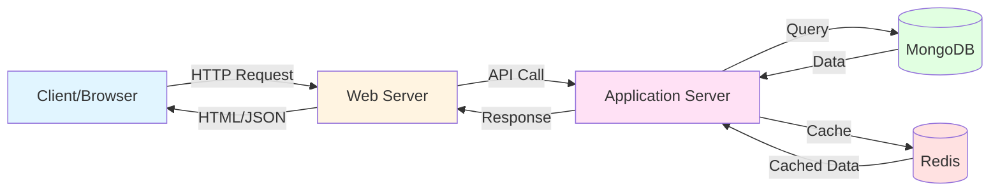
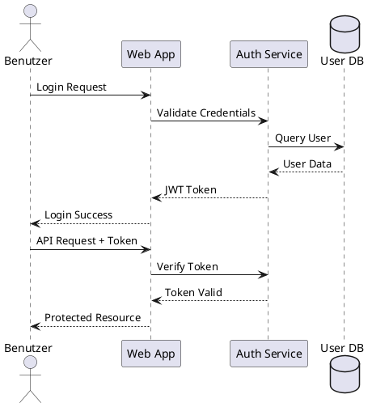

---
layout: default
title: NoSQL
subtitle: Relevanz im Big-Data Kontext
colorSchema: light
chapter: Test
presentation: MongoDB und Redis im Big-Data Kontext
footnotes:
  - "Unter anderem werden keine UI-Elemente betrachtet."
  - "Bildquelle: Eigene Darstellung (erstellt mit Mermaid.js)"
---

<Outline>
  <OutlineItem :number="1">Einführung</OutlineItem>
  <OutlineItem :number="2">Konzeptuelle Modellierung</OutlineItem>
  <OutlineItem :number="3">Informationsarchitektur</OutlineItem>
  <OutlineItem :number="4">Interaktionsdesign</OutlineItem>
  <OutlineItem :number="5">Interfacedesign</OutlineItem>
  <OutlineItem :number="6" active>Informationsdesign</OutlineItem>
  <OutlineItem :number="7" disabled>Sensorisches Design</OutlineItem>
  <OutlineItem :number="8" disabled>Gestaltungsrichtlinien</OutlineItem>
</Outline>

---
layout: default
title: NoSQL
subtitle: Relevanz im Big-Data Kontext
chapter: Test
presentation: MongoDB und Redis im Big-Data Kontext
source: https://www.geeksforgeeks.org/dbms/types-of-nosql-databases/
---

<Quotebox source="[UXQ23, S. 39]">
  Ein Nutzungsszenario (use scenario) ist eine "erzählende, textuelle Beschreibung,
  wie ein Benutzer eine oder mehrere Aufgaben mit dem geplanten interaktiven
  System ausführen wird".
</Quotebox>

<BulletedList title="Anmerkungen">
  <li>
    Es beschreibt die konkrete Erledigung einer Aufgabe am <span class="highlight">zukünftigen</span> System aus der Perspektive des Benutzers
    <SubText>Technische Aspekte des interaktiven Systems bleiben außen vor</SubText>
  </li>
  <li>
    Typische Darlegungsformen: Narrative Form, Storyboard
    <SubText>Zur Veranschaulichung von Nutzungsszenarien können zudem <span class="highlight">User Journey Maps</span> dienen</SubText>
  </li>
</BulletedList>
---
layout: default
title: Text Komponente Demo
subtitle: Mit SubText Beispielen
chapter: Test
presentation: MongoDB und Redis im Big-Data Kontext
---

<Columns>

<Text title="Text Komponente">
  Dies ist ein normaler Text mit der <span class="highlight">highlight</span> Klasse für wichtige Begriffe.
  <SubText>Dies ist ein SubText, der zusätzliche Informationen liefert und in grauer Farbe dargestellt wird.</SubText>
</Text>

<Text title="Weiteres Beispiel">
  Die <span class="highlight">Text-Komponente</span> folgt dem gleichen Pattern wie BulletedList.
  <SubText>Sie unterstützt auch <span class="highlight">Highlights</span> innerhalb des SubTexts für besondere Hervorhebungen.</SubText>
</Text>

</Columns>

---
layout: default
title: HighlightBox Demo
subtitle: Hervorgehobene Infoboxen
chapter: Test
presentation: MongoDB und Redis im Big-Data Kontext
---

<HighlightBox title="Farbwiedergabe">
  Ausgabegeräte können nur einen Ausschnitt eines Farbraums darstellen, den sog. Gamut. Die Wiedergabe einer Farbe kann zudem von Gerät zu Gerät variieren (z. B. IPS vs. OLED-Panel).
</HighlightBox>

---
layout: default
title: Table Komponente Demo
subtitle: Mit alternierenden Zeilen
chapter: Test
presentation: MongoDB und Redis im Big-Data Kontext
---

<Table 
  :headers="['Auszug aus dem Ist-Szenario', 'Identifizierte Erfordernisse']"
  :rows="[
    [
      'Patienten müssen oft über den vereinbarten Termin hinaus auf ihre Behandlung warten. Das Warten ist für die Patienten sehr ärgerlich, vor allem, wenn sie bis zu 90 Minuten im Wartezimmer sitzen müssen, ohne dass klar ist, wie lange es noch dauert, bis sie an der Reihe sind.',
      'Der Patient (Benutzergruppe) muss vor Ankunft in der Arztpraxis wissen, wann der vereinbarte Behandlungstermin tatsächlich beginnt (Information), um die verbleibende Zeit sinnvoll nutzen zu können (beabsichtigtes Ergebnis).'
    ],
    [
      'Die Patienten vereinbaren ihre Termine oft lange im Voraus, da gute Ärzte nicht kurzfristig verfügbar sind.',
      'Der Patient (Benutzergruppe) muss einen vereinbarten Behandlungstermin haben (Ressource), um zum vereinbarten Zeitpunkt behandelt zu werden (beabsichtigtes Ergebnis).'
    ],
    [
      'Allgemeinmediziner haben es mit einer großen Vielfalt von Krankheiten zu tun. Sie stellen Diagnosen jedoch schnell, und die Patienten verlassen sich auf die von ihnen verschriebenen Behandlungen.',
      'Der Arzt (Benutzergruppe) muss die Kompetenz besitzen, die richtige Diagnose zu stellen (Kompetenz), um die richtige Therapie zu bestimmen (beabsichtigtes Ergebnis).'
    ]
  ]"
  caption="Beispiele für identifizierte Erfordernisse in Nutzungskontextinformationen<sup>1</sup>"
/>

---
layout: default
title: Image Komponente Demo
subtitle: Mit Caption und Source
chapter: Test
presentation: MongoDB und Redis im Big-Data Kontext
---

<StackedLayout>

<Image 
  title="Ionic Framework Beispiel"
  src="/images/fh-logo.jpg"
  alt="FH Münster Logo"
  caption="Jedes <ion-item>-Element ist ein Listeneintrag (Zeile); es kann mehrere UI-Elemente zu einem Listeneintrag bündeln"
  source="Quelle: FH Münster"
  maxWidth="500px"
/>

<Text title="Image Features">
  Die Image-Komponente unterstützt <span class="highlight">Titel</span>, <span class="highlight">Caption</span> und <span class="highlight">Source</span>.
  <SubText>Perfekt für annotierte Bilder in Präsentationen</SubText>
</Text>

</StackedLayout>

---
layout: default
title: Code Komponente Demo
subtitle: Mit Syntax-Highlighting
chapter: Test
presentation: MongoDB und Redis im Big-Data Kontext
---

<StackedLayout>

<Columns>

<Code title="TypeScript Beispiel">

```typescript
import { IonButton } from '@ionic/core/components/ion-button.js';
import { IonIcon } from 'ionicons/components/ion-icon.js';
import { initialize } from '@ionic/core/components';
import { star } from 'ionicons/icons';

initialize();
addIcons({ 'star': star });
customElements.define('ion-button', IonButton);
customElements.define('ion-icon', IonIcon);
```

</Code>

<Code title="Vue Template Beispiel">

```vue
<ion-app>
  <ion-header>
    <ion-toolbar><ion-title>Listen</ion-title></ion-toolbar>
  </ion-header>
  <ion-content>
    <ion-list>
      <ion-list-header>Title</ion-list-header>
      <ion-item>Non clickable</ion-item>
      <ion-item button>Clickable</ion-item>
    </ion-list>
  </ion-content>
</ion-app>
```

</Code>

</Columns>

</StackedLayout>

---
layout: default
title: Nativ Slidev Code-Blöcke
subtitle: Mit Line Highlighting
chapter: Test
presentation: MongoDB und Redis im Big-Data Kontext
---

# Mit Slidev Features

Slidev unterstützt Line Highlighting direkt:

```typescript {2,5-7}
import { IonButton } from '@ionic/core/components/ion-button.js';
import { IonIcon } from 'ionicons/components/ion-icon.js';
import { initialize } from '@ionic/core/components';
import { star } from 'ionicons/icons';

initialize();
addIcons({ 'star': star });
```

<BulletedList title="Slidev Code Features">
  <li>
    <span class="highlight">Line Highlighting</span>: Mit {2,5-7} Syntax
    <SubText>Hebt bestimmte Zeilen hervor</SubText>
  </li>
  <li>
    <span class="highlight">Shiki Syntax</span>: Automatisches Highlighting
    <SubText>Unterstützt alle gängigen Sprachen</SubText>
  </li>
</BulletedList>

---
layout: default
title: Quellen
subtitle: Literaturverzeichnis
chapter: Test
presentation: MongoDB und Redis im Big-Data Kontext
---

<CitationTable 
  title="Quellen"
  :citations="[
    { id: '[GeT23]', text: 'Geis, T.; Tesch, G.: <em>Basiswissen Usability und User Experience.</em> 2. Aufl., dpunkt.verlag, 2023' },
    { id: '[GeP18]', text: 'Geis, T.; Polkehn, K.: <em>Praxiswissen User Requirements.</em> dpunkt.verlag, 2018' },
    { id: '[UXQ21]', text: 'UXQB e. V.: <em>CPUX-DS Curriculum und Glossar.</em> Version 1.01a DE, www.uxqb.org, 2021' },
    { id: '[UXQ23a]', text: 'UXQB e. V.: <em>CPUX-F Curriculum - Certified Professional for Usability and User Experience Foundation Level.</em> Version 4.01 DE, www.uxqb.org, 2023' },
    { id: '[UXQ23b]', text: 'UXQB e. V.: <em>CPUX-UR Curriculum - Certified Professional for Usability and User Experience \u2013 User Requirements Engineering.</em> Version 3.2.2 DE, www.uxqb.org, 2023' }
  ]"
/>

---
layout: default
title: Quellen
subtitle: Normen und Standards
chapter: Test
presentation: MongoDB und Redis im Big-Data Kontext
---

<CitationTable 
  title="Normen"
  :citations="[
    { id: 'DIN EN ISO 9241-11:2018', text: 'Ergonomie der Mensch-System-Interaktion \u2013 Teil 11: Gebrauchstauglichkeit: Begriffe und Konzepte (ISO 9241-11:2018); Deutsche Fassung EN ISO 9241-11:2018, November 2018' },
    { id: 'DIN EN ISO 9241-110:2020', text: 'Ergonomie der Mensch-System-Interaktion \u2013 Teil 110: Interaktionsprinzipien (ISO 9241-110:2020); Deutsche Fassung EN ISO 9241-110:2020, Oktober 2020' },
    { id: 'DIN EN ISO 9241-210:2020', text: 'Ergonomie der Mensch-System-Interaktion \u2013 Teil 210: Menschzentrierte Gestaltung interaktiver Systeme (ISO 9241-210:2019); Deutsche Fassung EN ISO 9241-210:2019, M\u00e4rz 2020' }
  ]"
/>

---
layout: default
title: Mermaid Diagramm Demo
subtitle: Visualisierung mit Mermaid.js
chapter: Test
presentation: MongoDB und Redis im Big-Data Kontext
---

<StackedLayout>



<BulletedList title="Vorteile von Mermaid">
  <li>
    <span class="highlight">Einfache Syntax</span> zur Diagrammerstellung
    <SubText>Diagramme werden aus Text generiert und sind versionierbar</SubText>
  </li>
  <li>
    <span class="highlight">Verschiedene Diagrammtypen</span> unterstützt
    <SubText>Flowcharts, Sequence Diagrams, Class Diagrams, etc.</SubText>
  </li>
</BulletedList>

</StackedLayout>

---
layout: default
title: PlantUML Diagramm Demo
subtitle: UML-Diagramme mit PlantUML
chapter: Test
presentation: MongoDB und Redis im Big-Data Kontext
---

<StackedLayout>



<Text title="Anwendungsfälle">
  PlantUML eignet sich besonders für <span class="highlight">UML-Diagramme</span> und technische Dokumentation.
  <SubText>Ideal für Sequenzdiagramme, Klassendiagramme und Komponentendiagramme</SubText>
</Text>

</StackedLayout>

---
layout: cover
---

# Ende